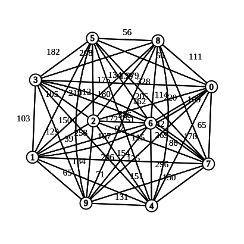

### Grupo: Trackers
Integrantes: 
Emmanuella Faustino Albuquerque 
Luyza Ellen Domingos do Nascimento 
Leandro Gomes do Nascimento 

### Entrada
Grafo Completo, Conexo e Simétrico(não-orientado)
 

### O Problema

#### Descrição
- Baseado no Problema do Caixeiro Viajante (TSP)
- Os agentes de uma empresa recebem um conjunto de endereços que devem visitar e aplicar o questionário(pesquisas de opinião, mercado, satisfação, etc)
- Qualquer agente pode realizar no máximo p questionários por dia
- Não existe um limite para o número de agentes disponíveis

#### Objetivo
- Atribuir um conjunto de endereços para cada um dos agentes e estabelecer a rota(o percurso) que eles deverão seguir, de forma a minimizar o tempo total gasto(redução de custos)

#### Condições
(i) - Todos os endereços são visitados exatamente uma vez;  
(ii) - Cada agente inicia e termina sua rota na sede da empresa;  
(iii) - A rota de cada um dos agentes não visita mais que p endereços;  

|Item|Descrição|
|:---:|:---:|
|Lista Q| Vértices que ainda não foram adicionados na solução|
|TRP| Traveling robin problem|
|Rota| Conjunto de endereços do problema|
|t(i,j)|  Tempo (em minutos) para percorrer o arco (i,j)|

### Algoritmos Construtivos utilizados
- Inserção mais barata

> Avalia a expressão c(u, x) + c(x, v) - c(u, v) para cada um dos vértices na solução  
> => onde x é o vértice que será inserido  
> => u, v os vértices no qual a aresta estão sendo analisada  
> => e c o custo de ir de um vértice ao outro.  

Obs: algoritmo guloso usado para dar uma solução inicial para o problema

|Método|Descrição|
|:---:|:---:|
|selectSequenceTriangle| Cria o triângulo pegando os 2 primeiros elementos da lista Q.|
|selectBestTriangle| Encontra o triângulo no qual os vértices(endereços) são os mais distantes possíveis. Ele vê qual o vértice mais distante(da lista Q), daquele que está sendo analisado no momento(que é o último vértice adicionado para formar o triângulo).|
|selectRandomTriangle| Encontra o triângulo escolhendo os vértices(endereços) da lista Q de forma aleatória.|

### Busca Local (ou Heurísticas de Refinamento)
- VND

### Movimentos de vizinhança (ou Estruturas de vizinhança) utilizados
- Intra: Swap
- Inter: Swap(1, 1)
- Intra: 2-opt
- Intra: Reinsertion
